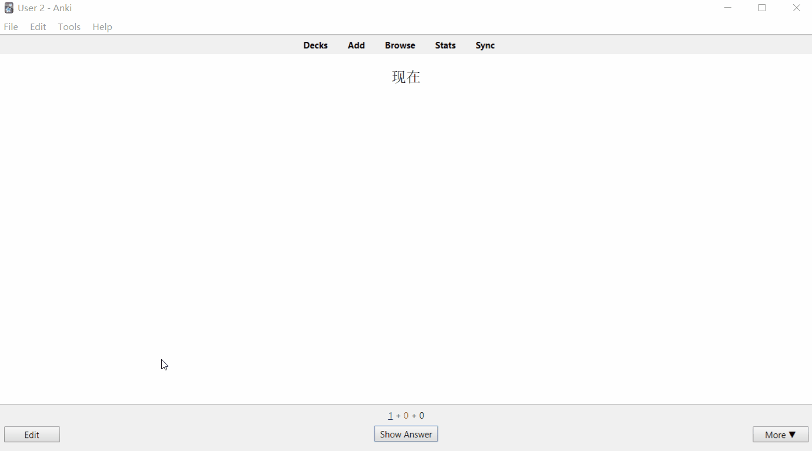

# Sentence Adder Anki Addon - For any languages
 Add sentences to Anki editor window in one click

 Select a word in edit field and click add button to add sentences to that fields matching the words. Also create/add sentences for any languages. The sentences database created using [tatoeba](https://tatoeba.org/eng/downloads) language tsv files. Download language tsv file from [tatoeba](https://tatoeba.org/eng/downloads).

 # Install
 Make backup before installing addons.

 Download addon from AnkiWeb<br>
 [Sentence Adder Anki Addon](https://ankiweb.net/shared/info/1682655437)

 Download from release page<br>
 [Sentence Adder Anki Addon](https://github.com/krmanik/Sentence-Adder-Anki-Addon/releases)

 # Features
 - Create new language database
 - Add random sentence in one click
 - View list of all sentences matching the selected word
 - Change language (Require restart of Anki to apply changes)
 - Change color of sentences
 - Add sentence pair (sentence and its translation)
 - Wrap word and sentence in html tag

 # Usage

 ## Tutorials
 - [Download Sentences data tsv files](demo/demo_download_tsv.gif)
 - [Create/Add Language database](demo/demo_add_lang.gif)
 - [Add random sentence to edit field](demo/demo_add_random_sen.gif)
 - [View list of all sentences](demo/demo_view_all_sen.gif)
 - [Batch add option](demo/batch_add_sentences.gif)

 ## Install
 1. Install Addon from [AnkiWeb](https://ankiweb.net/shared/info/1682655437)
 ```
 Anki -> Tools -> Add-ons -> Get Add-ons...
 ```
 Paste the code ```1682655437``` and install.

 2. Restart Anki and open the Addon to add new languages.
 3. Download language of choice from [tatoeba](https://tatoeba.org/eng/downloads)
 <br> View Demo [Download Sentences data tsv files](demo/demo_download_tsv.gif)
 4. Open the installed Addon in Anki
 ```
 Anki -> Tools -> Sentence Adder...
 ```
 5. Click Add new language
 6. Enter language name
 7. Select downloaded language tsv file 
 8. Click create to create/add new language to the Addon
 <br>View demo [Create/Add Language database](demo/demo_add_lang.gif)
 9. Restart Anki to apply changes

 ## Adding sentences to field in Anki
 1. First change preferences for the Anddon
 <br>There are two preferences
<br> a. Auto add sentences: Automatically add random sentences matching the words
<br> b. Open all sentences window: View list of all sentences and select as per choice from the list
 
 2. Select any text in editor window 
 3. Click add button to add sentences
 
 ## Demo
 

 # Sentences Database 
 [tatoeba](https://tatoeba.org/eng/downloads)

 # My other Anki addons and decks
 [Shared Decks and Addons](https://ankiweb.net/shared/byauthor/86203928)

 # License
 Mani
 <br> GPL 3.0
 [View Licence](License)